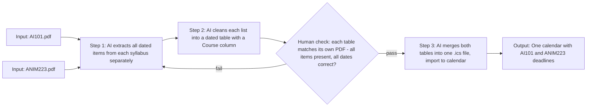

# Workflow diagram: [semester-calendar]

```mermaid
flowchart LR
    A1["Input: AI101.pdf"] --> B["Step 1: AI extracts all dated items from each syllabus separately"]
    A2["Input: ANIM223.pdf"] --> B
    B --> C["Step 2: AI cleans each list into a dated table with a Course column"]
    C --> D{"Human check: each table matches its own PDF - all items present, all dates correct?"}
    D -->|pass| E["Step 3: AI merges both tables into one .ics file, import to calendar"]
    D -->|fail| B
    E --> F["Output: One calendar with AI101 and ANIM223 deadlines"]
```